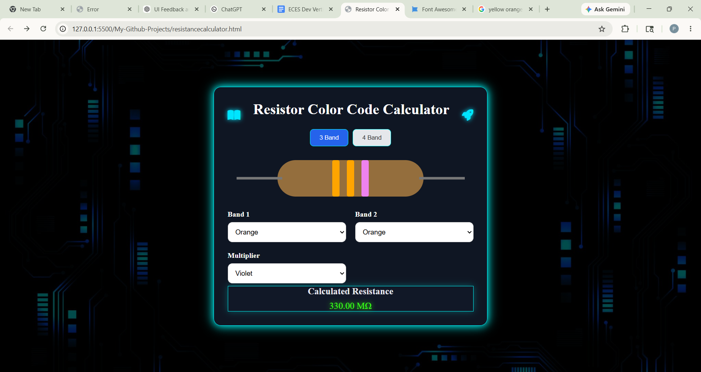

# Resistor-Color-Code-Calaculator

A modern and interactive **Resistance Calculator** built using **HTML, CSS, and JavaScript**.

This project helps users quickly calculate resistor resistance values using resistor band colors with support for both **3-band** and **4-band** resistors.This is my first Github project.

---
## Live Link 
https://meghana413.github.io/Resistor-Color-Code-Calaculator/
## 🚀 Features

- 🎨 Interactive resistor color selection
- ⚡ Supports:
  - 3 Band Resistors
  - 4 Band Resistors
- 📏 Automatic resistance calculation
- 📊 Tolerance calculation for 4-band mode
- 🔥 Dynamic resistor stripe visualization
- 🌌 Futuristic neon UI design
- 📱 Fully responsive layout

---

## 🛠️ Technologies Used

- HTML5
- CSS3
- JavaScript (Vanilla JS)
- Font Awesome Icons

---

## 📷 Project Preview

### Main Interface




---

## 📂 Project Structure

```bash
📁 resistance-calculator
│
├── index.html
├── style.css
├── README.md
│
└── assets
    └── screenshot.png
